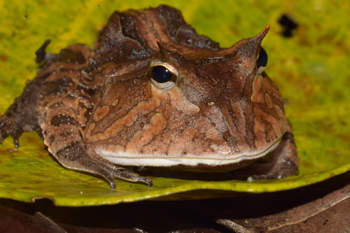
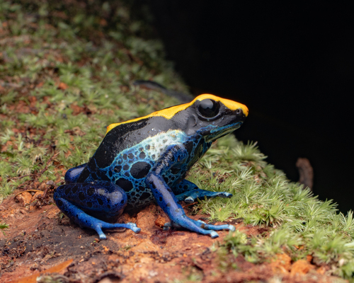

# CNN: 5 видов лягушек

## Лягушки

<table>
  <thead>
    <tr>
      <th>1. Agalychnis <br>callidryas</th>
      <th>2. Breviceps <br>gibbosus</th>
      <th>3. Ceratophrys <br>cornuta</th>
      <th>4. Dendrobates <br>tinctorius</th>
      <th>5. Hyalinobatrachium <br>fleischmanni</th>
    </tr>
  </thead>
  <tbody>
    <tr>
      <td></td>
      <td></td>
      <td></td>
      <td></td>
      <td></td>
  </tbody>
</table>


## Как использовать

### Подготовка окружения

```bash
python3 -m venv .venv
source .venv/bin/activate
pip install -r req.txt

deactivate
```

### Обучение

```bash
code cnn.ipynb
```

### Inference

```bash
# ...
```


## Структура проекта

```bash
tree -F -I ".venv|.git|readme.md"

./
├── cnn.ipynb
│   # ML main algorithm
│
├── req.txt
│   # requirements for cnn.ipynb
│
├── dataset/
│   # 1/ ... 5/
│
└── internal/
```


## Учебные материалы 

- [x] [Convolution Neural Network](https://www.youtube.com/watch?v=HGwBXDKFk9)

  Как работает CNN в общих чертах.  

- [ ] [Softmax Activation Function](https://www.pinecone.io/learn/softmax-activation/)  

  **Формулы**  

  | ReLU | Sigmoid | Softmax |
  |:-----|:--------|:--------|
  | $relu(x)=\max(0,x)$ | $\sigma(x)=\frac{1}{1+e^{-x}}$ | $\sigma_i(\mathbf{z})=\frac{e^{z_i}}{\sum_{j}\ e^{z_j}}$ |  

  **О чем расскажет эта статья**

  - Как использовать **Softmax** в качестве функции активации для последнего слоя весов в задаче классификации.
  - Как **Softmax** преобразует вектор логитов в вектор вероятностей.
  - **Softmax** как обобщение Sigmoid. Частный случай: бинарная классификация.
  - Реализация функций активации на Python.  

- [ ] [CNN practice](https://www.youtube.com/watch?v=jztwpsIzEGc)  

- [ ] [DVC practice](https://www.youtube.com/playlist?list=PL7WG7YrwYcnDb0qdPl9-KEStsL-3oaEjg)  


## Roadmap

- [ ] https://www.gbif.org

---

- [ ] 500 img / spec
- [ ] 80 train / 20 test
- [ ] size /= 255.0

---

- [ ] Conv - ReLU - MaxPool
- [ ] Conv - ReLU - Flatten
- [ ] Dense (?)
- [ ] SoftMax

---

- [ ] 5-10 эпох
- [ ] Accuracy

---

- [ ] predict.py
- [ ] DVC

---

- [ ] Не-лягушка
- [ ] Выбор гиперпараметров.  
Кросс-валидация: cложность вычислений / Accuracy
